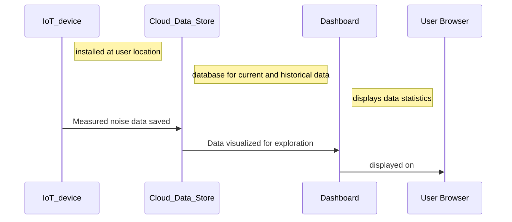

# About Project Noise Meter

> Are you curious about the health impact of the environmental noise in Toronto?
> 
> Are you interested in measuring the environmental noise in Toronto?
> 
> Is the environmental noise in Toronto a public health concern?

We started Project Noise Meter to answer these questions. The project is building low cost IoT devices for citizens to measure in real-time the ambient environmental noise in their neigbourhoods. A data store and a monitoring dashboard are being developed to collect and visualize the noise data. The project is under active development by a group of Civic Tech Toronto volunteers.

Keep reading below to learn more about the project.

## Project Building Stones
- [Noise Dashboard](https://github.com/danieltsoukup/noise-dashboard)
- [Project Noise Meter Device](https://github.com/CivicTechTO/proj-noisemeter-device)
- Mobile App (coming soon)
- Website (coming soon)

## Project Roadmap
Coming soon

## How to contribute
This is a volunteer driven project and contribution from everyone with any skill set and experiences are welcome. 

There are a few ways to connect with us and help:
1. Attend a [Civic Tech Toronto hacknight](https://civictech.ca/) and join our project.
1. Review the [Project Noise Meter Issues](https://github.com/CivicTechTO/proj-noisemeter/issues) page and select a task to work on.
1. Reach to the [project community in Slack](https://civictechto.slack.com/archives/C05LHL4L8MD) and suggest a task that you are interested in working on.  

## Privacy by design
Coming Soon

## Tecnical Overview

## FAQ about the Noise Meter Device
Coming soon

## FAQ about the Noise Dashboard
Coming soon

